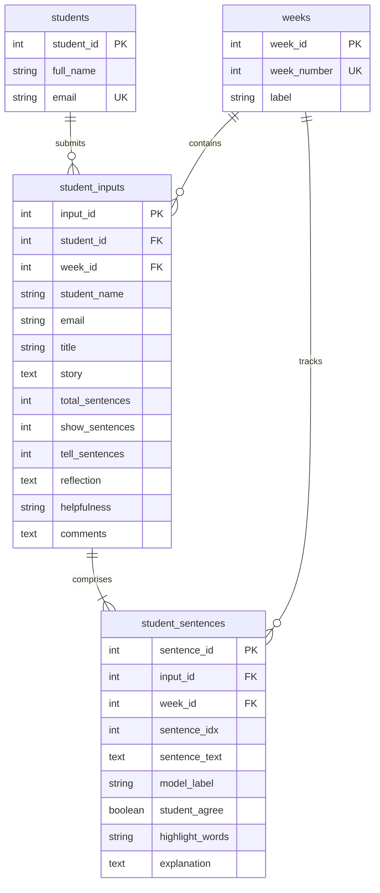

# Data-Story-Reading-App

A Streamlit-based educational tool that analyzes written data stories by classifying sentences as **"Show"** (descriptive observations), **"Tell"** (interpretive claims), or **"Sentence Fragment"** (non-sentences). Built to help students improve their data storytelling skills through AI-powered feedback.

## Features

- **Sentence Classification** — Classifies each sentence as Show, Tell, or Sentence Fragment using OpenRouter AI (Google Gemini)
- **AI-Generated Explanations** — Provides contextual justifications for each classification via OpenRouter API
- **Key Phrase Highlighting** — LLM identifies and highlights 1–3 verbatim key phrases that best indicate why a sentence is Show or Tell
- **Student Feedback Collection** — Students can agree/disagree with classifications and leave reflections
- **Visual Breakdown** — Matplotlib charts showing Show vs Tell vs Sentence Fragment distribution
- **Email Feedback** — Sends classification summaries to students via Gmail SMTP
- **Database Persistence** — Stores submissions, sentence-level data, and feedback in MySQL
- **Auto Week & Image Scheduling** — Week number and chart image update automatically based on a configured course start date

## Tech Stack

| Component | Technology |
|-----------|------------|
| Web Framework | Streamlit |
| NLP Tokenization | NLTK |
| Sentence Splitting | OpenAI GPT-4.1-mini |
| Classification | OpenRouter API (Google Gemini `gemini-3.1-flash-lite-preview`) |
| Highlights & Explanations | OpenRouter API (Google Gemini `gemini-3.1-flash-lite-preview`) |
| Database | MySQL |
| Visualization | Matplotlib |

## Project Structure

```
Data-Story-Reading-App/
├── streamlit_predict_app.py    # Main application
├── requirements.txt            # Python dependencies
├── Procfile.txt                # Heroku deployment config
├── LICENSE                     # MIT License
├── .streamlit/
│   └── secrets.toml            # API keys & DB credentials (not committed)
├── utils/
│   ├── func.py                 # Helper functions (LLM calls via OpenRouter)
│   └── __init__.py
└── images/                     # Chart prompts for student exercises
    ├── dog_walk.png
    ├── chart_prompt.png
    ├── math_reading.png
    ├── stem_prompt.png
    ├── time_survey.png
    ├── wealth_survey.png
    ├── youtube_prompt.png
    └── AI_related_roles.png
```

## Setup

### 1. Install dependencies

```bash
pip install -r requirements.txt
```

### 2. Configure secrets

Create `.streamlit/secrets.toml` with the following:

```toml
OPENAI_API_KEY = "your-openai-api-key"
OPENROUTER_API_KEY = "your-openrouter-api-key"
EMAIL_ADDRESS = "your-gmail@gmail.com"
EMAIL_PASSWORD = "your-gmail-app-password"
DB_HOST = "your-db-host"
DB_PORT = "3306"
DB_NAME = "your-db-name"
DB_USER = "your-db-user"
DB_PASSWORD = "your-db-password"

# Auto week/image config
COURSE_START_DATE = "YYYY-MM-DD"   # First day of Week 1 in your course
WEEK_IMAGES = [
  "chart_prompt.png",   # Week 1
  "math_reading.png",   # Week 2
  "stem_prompt.png",    # Week 3
  "time_survey.png",    # Week 4
  "wealth_survey.png",  # Week 5
  "youtube_prompt.png", # Week 6
  "AI_related_roles.png", # Week 7
  "dog_walk.png",       # Week 8
]
```

> **Note:** The app calculates the current week automatically from `COURSE_START_DATE` using `(today − start_date) / 7 + 1`. The chart image is picked from `WEEK_IMAGES` by week index — no manual changes required each week.

#### Changing the week image schedule

Edit `WEEK_IMAGES` in `secrets.toml` (or Heroku config vars) to assign a different chart image to each week. Filenames refer to images in the `images/` directory. You can repeat filenames across weeks if needed.

### 3. Run the app

```bash
streamlit run streamlit_predict_app.py
# or
python -m streamlit run streamlit_predict_app.py
```

The app will be available at `http://localhost:8501`.

## Deployment

Configured for Heroku via `Procfile.txt`:

```
web: streamlit run streamlit_predict_app.py --server.port $PORT --server.address 0.0.0.0
```

Set the secrets as Heroku config vars instead of using `secrets.toml`.

## Architecture

```
┌─────────────────────────────────────────────────────────────────┐
│                        Streamlit UI                             │
│              (streamlit_predict_app.py)                         │
│                                                                 │
│   Page 1: Input  →  Page 2: Analysis  →  Page 3: Submission    │
└──────┬──────────────────┬───────────────────────┬───────────────┘
       │                  │                       │
       ▼                  ▼                       ▼
┌─────────────┐  ┌────────────────────┐  ┌────────────────┐
│   NLTK      │  │  OpenRouter API    │  │  MySQL         │
│  Tokenizer  │  │  (Google Gemini)   │  │  Database      │
│             │  │                    │  │                │
│  OpenAI API │  │  1. Classify as    │  │  students      │
│  (GPT-4.1   │  │     Show / Tell /  │  │  weeks         │
│   mini)     │  │     Sentence Frag. │  │  student_inputs│
│  Sentence   │  │                    │  │  student_      │
│  Splitting  │  │  2. Highlight key  │  │   sentences    │
└─────────────┘  │     phrases        │  └───────┬────────┘
                 │                    │          │
                 │  3. Generate       │          ▼
                 │     explanations   │  ┌────────────────┐
                 └────────────────────┘  │  Gmail SMTP    │
                                         │  Email Feedback│
                                         └────────────────┘
```

### Data Flow

1. **Input** — Student enters name, email, story title, and writes a data story about a provided chart
2. **Tokenization** — NLTK splits text into sentences. Long/complex sentences are further split using **OpenAI API** (GPT-4.1-mini)
3. **Classification** — Each sentence is sent to **OpenRouter API** (Google Gemini) and classified as Show, Tell, or Sentence Fragment
4. **Enrichment** — The same **OpenRouter API** identifies 1–3 key highlight phrases and generates a 1–2 sentence explanation per classification
5. **Feedback** — Student reviews classifications, agrees/disagrees, and writes a reflection
6. **Persistence** — All data is saved to **MySQL**; a summary email is sent via **Gmail SMTP**

### Database Schema



### External API Usage

| API | Model | Purpose | Called In |
|-----|-------|---------|----------|
| **OpenAI** | GPT-4.1-mini | Splits complex sentences into individual ones | `split_with_llm()` in `streamlit_predict_app.py` |
| **OpenRouter** | google/gemini-3.1-flash-lite-preview | Classifies sentences as Show / Tell / Sentence Fragment | `classify_sentences_with_openrouter()` |
| **OpenRouter** | google/gemini-3.1-flash-lite-preview | Generates key phrase highlights and explanations | `call_openrouter_llm()` in `utils/func.py` |

## How It Works

1. **Input** — Students enter their name, email, story title, and write a data story about a provided chart
2. **Analysis** — Sentences are tokenized (NLTK), optionally split with GPT-4.1-mini, then classified by Google Gemini via OpenRouter. Each sentence gets an AI explanation and highlighted key phrases
3. **Feedback** — Students review classifications, agree or disagree, and write a reflection
4. **Submission** — Results are saved to MySQL and a feedback email is sent to the student

## License

This project is licensed under the [MIT License](LICENSE) — free to use, modify, and distribute with attribution.
